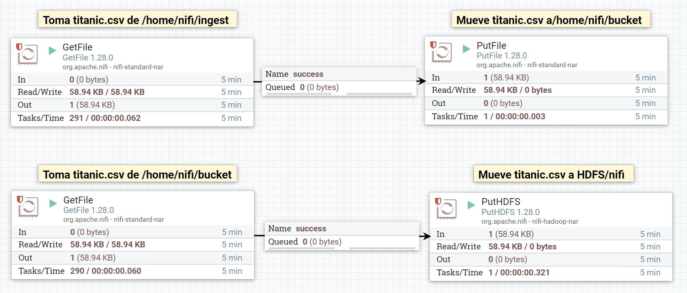
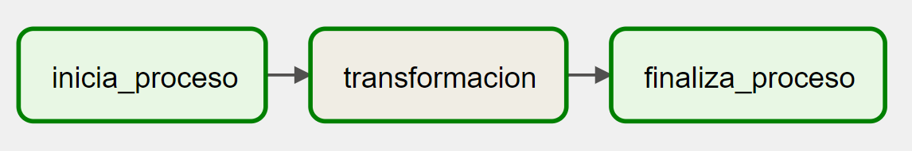
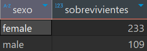
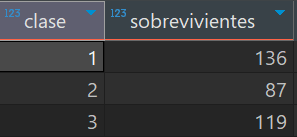
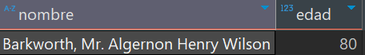
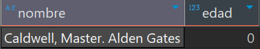

# Resolucion ejercitacion 10

#### 1. En el shell de Nifi, crear un script .sh que descargue el archivo titanic.csv al directorio `/home/nifi/ingest` (crearlo si es necesario). Ejecutarlo con `./home/nifi/ingest/ingest.sh`.

```bash
# Indica que interprete debe usar el script
#!/bin/bash

# Descarga el archivo a la carpeta landing
wget -P /home/nifi/ingest https://dataengineerpublic.blob.core.windows.net/data-engineer/titanic.csv
```

#### 2. Usando procesos en Nifi:

#### 3. tomar el archivo titanic.csv desde el directorio `/home/nifi/ingest`.

#### 4. Mover el archivo titanic.csv desde el directorio anterior, a /home/nifi/bucket (crear el directorio si es necesario).

#### 5. Tomar nuevamente el archivo, ahora desde `/home/nifi/bucket`.

#### 6. Ingestarlo en HDFS/nifi (si es necesario, crear el directorio con `hdfs dfs -mkdir /nifi` ).

### Proceso completo en Nifi



#### 7) Una vez que tengamos el archivo titanic.csv en HDFS realizar un pipeline en Airflow que ingeste este archivo y lo cargue en HIVE, teniendo en cuenta las siguientes transformaciones:

    a) Remover las columnas SibSp y Parch

    b) Por cada fila calcular el promedio de edad de los hombres en caso que sea hombre y promedio de edad de las mujeres en caso que sea mujer

    c) Si el valor de cabina en nulo, dejarlo en 0 (cero)

Creacion de la Base de datos en `Hive`:

```SQL
CREATE DATABASE titanic_nifi;
```

Creacion de la tabla en `Hive`:

```bash
CREATE EXTERNAL TABLE titanic_nifi(
    Sex STRING,
    passengerid INT,
    survived INT,
    pclass INT,
    Name STRING,
    age INT,
    Ticket STRING,
    fare FLOAT,
    Cabin STRING,
    Embarked STRING,
    avg_age INT
    )
COMMENT "BD Ejercicio NIfi y Airflow"
ROW FORMAT DELIMITED
FIELDS TERMINATED BY '\t'
location '/tables/external/titanic_nifi';
```

Creacion del script de transformciones en `PySpark`:

```python
# Import librerias y creacion de sesion en Spark
from pyspark.sql import SparkSession
from pyspark.sql.functions import avg, round, col

spark = SparkSession.builder \
    .appName("Titanic") \
    .enableHiveSupport() \
    .getOrCreate()

# Carga de datos
titanic = spark.read.option('header', 'true').csv('hdfs://172.17.0.2:9000/nifi/titanic.csv')

# Remueve columnas 'SibSp' y 'Parch'
titanic_mod = titanic.drop('SibSp', 'Parch')

# Agrupacion por edad y promedio de edad
gp_sex = titanic_mod.groupBy('Sex').agg(round(avg('Age'), 0).alias('avg_age')).withColumn('avg_age', col('avg_age').cast('integer'))

# Une df original con la agrupacion
titanic_age = titanic_mod.join(gp_sex, on='Sex', how='inner')

# Rellena nulos con 0
titanic_final = titanic_age.fillna("0", ["Cabin"])

# Castea columna a formato correspondiente
titanic_final = titanic_final \
    .withColumn("passengerid", col("passengerid").cast("integer")) \
    .withColumn("survived", col("survived").cast("integer")) \
    .withColumn("pclass", col("pclass").cast("integer")) \
    .withColumn("age", col("age").cast("integer")) \
    .withColumn("fare", col("fare").cast("float"))

# Inserta los datos en la BD
titanic_final.write.insertInto("titanic_nifi.titanic_nifi")
```

*DAG* en `Airflow`:

```python
from datetime import timedelta
from airflow import DAG
from airflow.operators.bash import BashOperator
from airflow.operators.dummy import DummyOperator
from airflow.utils.dates import days_ago

args = {
    'owner': 'airflow',
}

with DAG(
    dag_id='Titanic_nifi',
    default_args=args,
    schedule_interval='0 0 * * *',
    start_date=days_ago(1),
    catchup=False,
    dagrun_timeout=timedelta(minutes=60),
    tags=['ingest', 'transform'],
    params={"example_key": "example_value"},
) as dag:
    
    inicia_proceso = DummyOperator(
        task_id='inicia_proceso',
    )

    finaliza_proceso = DummyOperator(
        task_id='finaliza_proceso',
    )

    transform = BashOperator(
        task_id='transformacion',
        bash_command='ssh hadoop@172.17.0.2 /home/hadoop/spark/bin/spark-submit --files /home/hadoop/hive/conf/hive-site.xml /home/hadoop/scripts/titanic_nifi_transformation.py ',
    )

    inicia_proceso >> transform >>finaliza_proceso

if __name__ == "__main__":
    dag.cli()
```



#### 8) Una vez con la información en el datawarehouse calcular:

    a) Cuántos hombres y cuántas mujeres sobrevivieron

```sql
SELECT
	tn.sex AS `Sexo`,
	SUM(tn.survived) AS `Sobrevivientes`
FROM titanic_nifi tn
WHERE tn.survived = 1
GROUP BY tn.sex;
```



    b) Cuántas personas sobrevivieron según cada clase (Pclass)

```sql
SELECT
	tn.pclass AS `Clase`,
	SUM(tn.survived) AS `Sobrevivientes`
FROM titanic_nifi tn
WHERE tn.survived = 1
GROUP BY tn.pclass;
```



    c) Cuál fue la persona de mayor edad que sobrevivió

```sql
SELECT
	tn.name AS `Nombre`,
	tn.age AS `edad`
FROM titanic_nifi tn
WHERE tn.survived = 1
ORDER BY edad DESC
LIMIT 1;
```



    d) Cuál fue la persona más joven que sobrevivió

```sql
SELECT
	tn.name AS `Nombre`,
	tn.age AS `edad`
FROM titanic_nifi tn
WHERE tn.survived = 1
AND tn.age IS NOT NULL
ORDER BY edad
LIMIT 1;
```

