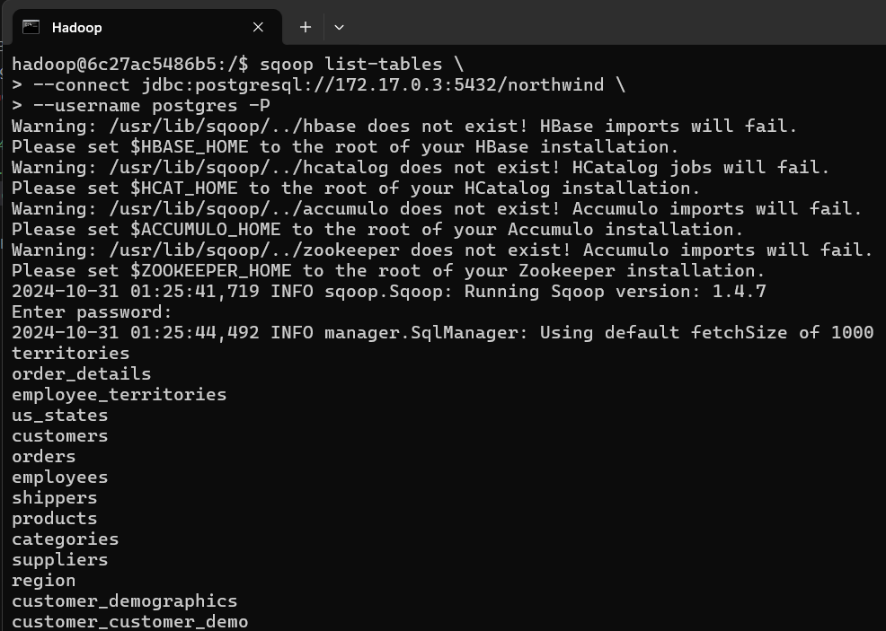
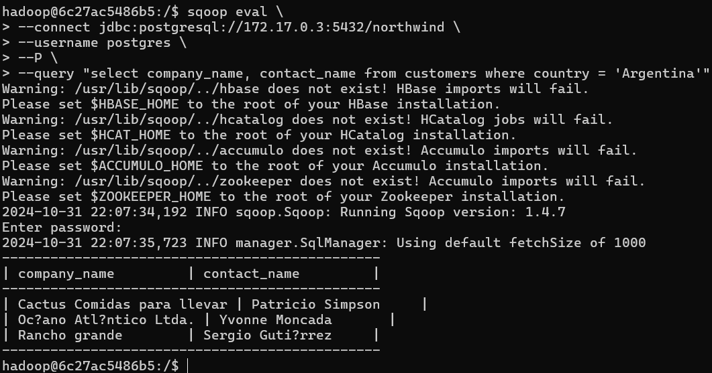
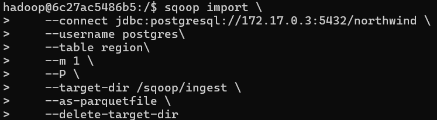
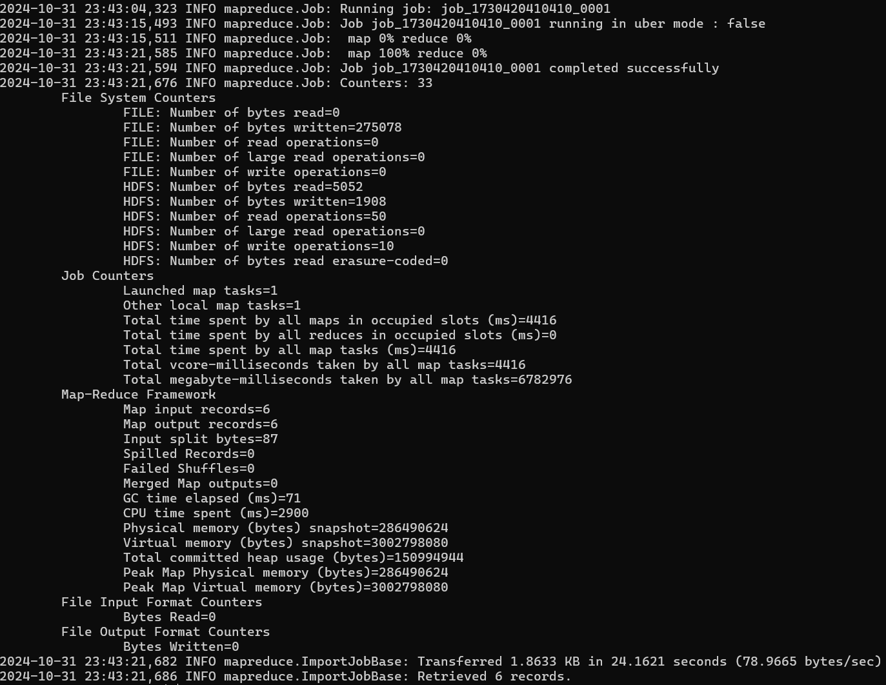
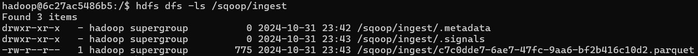
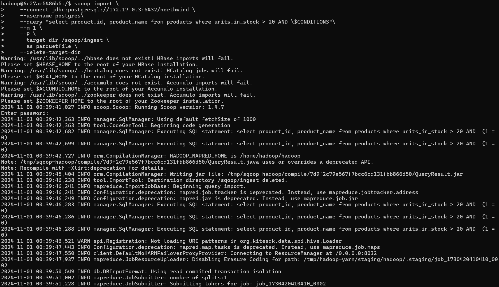
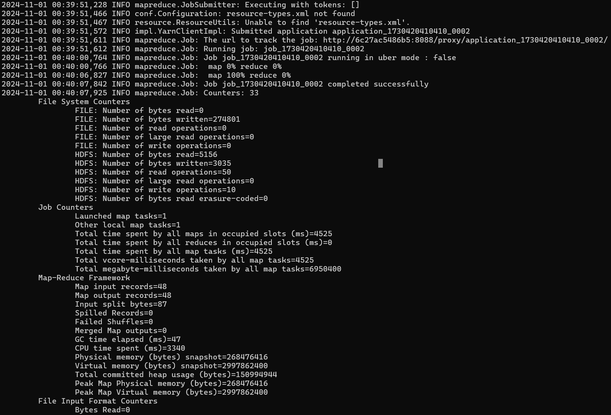
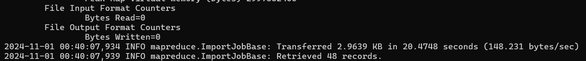
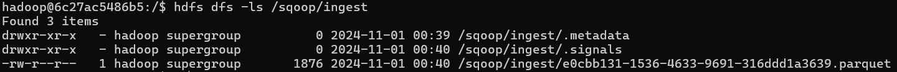

# Solucion Ejercicios Clase 4 

- Archivo con las consignas
- Consigna con solucion:

## Ejercicios Sqoop

### **1)** Mostrar las tablas de la base de datos northwind

```
sqoop list-tables \
--connect jdbc:postgresql://172.17.0.3:5432/northwind \
--username postgres -P
```



### **2)** Mostrar los clientes de Argentina

```
sqoop eval \
--connect jdbc:postgresql://172.17.0.3:5432/northwind \
--username postgres \
--m 1 \
--P \
--query "select company_name, contact_name from customers where country =  Argentina'"
```


### **3)** Importar un archivo .parquet que contenga toda la tabla orders. Luego ingestar el archivo a HDFS (*carpeta /sqoop/ingest*)

```
# Importa tabla orders como .parquet
sqoop import \
    --connect jdbc:postgresql://172.17.0.3:5432/northwind \
    --username postgres\
    --table region\
    --m 1 \
    --P \
    --target-dir /sqoop/ingest \
    --as-parquetfile \
    --delete-target-dir
```





#### Archivo .parquet en HDFS



###  **4)** Importar un archivo .parquet que contenga solo los productos con mas 20 unidades

```
sqoop import \
    --connect jdbc:postgresql://172.17.0.3:5432/northwind \
    --username postgres\
    --query "select product_id, product_name from products where units_in_stock > 20 AND \$CONDITIONS"\
    --m 1 \
    --P \
    --target-dir /sqoop/ingest \
    --as-parquetfile \
    --delete-target-dir
```







#### Archivo .parquet en HDFS



---

## Ejercicios Nifi

### 1) En el shell de Nifi, crear un script `.sh` que descargue el archivo `starwars.csv` al directorio `/home/nifi/ingest` (crearlo si es necesario). Ejecutarlo con `./home/nifi/ingest/ingest.sh`

URL: `https://github.com/fpineyro/homework-0/blob/master/starwars.csv`

Script creado como [ingest.sh](https://github.com/EmanuelRodriguezBedeman/Data-Engineering-EDVAI/blob/main/Clase%204/ingest.sh)

2) 