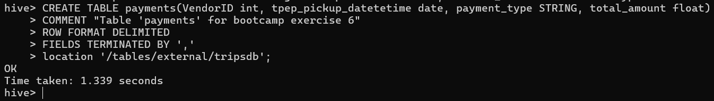
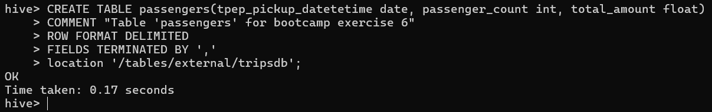
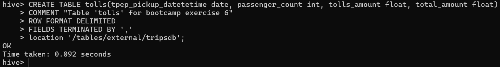
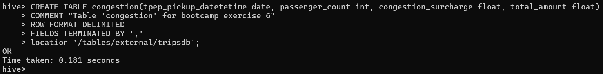
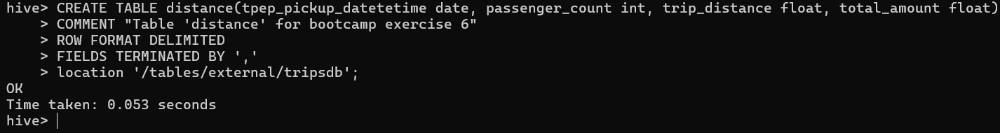
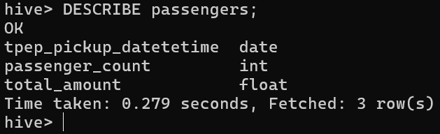
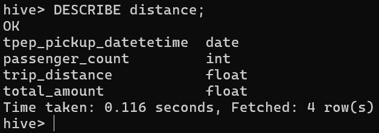

# Resolucion ejercicios

## 1. En Hive, crear las siguientes tablas (internas) en la base de datos `tripdata` en hive

* `payments(VendorID, tpep_pickup_datetetime, payment_type, total_amount)`

```
CREATE TABLE payments(VendorID int, tpep_pickup_datetetime date, payment_type STRING, total_amount float)
COMMENT "Table 'payments' for bootcamp exercise 6"
ROW FORMAT DELIMITED
FIELDS TERMINATED BY ','
location '/tables/external/tripsdb';
```



* `passengers(tpep_pickup_datetetime, passenger_count, total_amount)`

```
CREATE TABLE passengers(tpep_pickup_datetetime date, passenger_count int, total_amount float)
COMMENT "Table 'passengers' for bootcamp exercise 6"
ROW FORMAT DELIMITED
FIELDS TERMINATED BY ','
location '/tables/external/tripsdb';
```



* `tolls(tpep_pickup_datetetime, passenger_count, tolls_amount, total_amount)`

```
CREATE TABLE tolls(tpep_pickup_datetetime date, passenger_count int, tolls_amount float, total_amount float)
COMMENT "Table 'tolls' for bootcamp exercise 6"
ROW FORMAT DELIMITED
FIELDS TERMINATED BY ','
location '/tables/external/tripsdb';
```



* `congestion(tpep_pickup_datetetime, passenger_count, congestion_surcharge, total_amount)`

```
CREATE TABLE congestion(tpep_pickup_datetetime date, passenger_count int, congestion_surcharge float, total_amount float)
COMMENT "Table 'congestion' for bootcamp exercise 6"
ROW FORMAT DELIMITED
FIELDS TERMINATED BY ','
location '/tables/external/tripsdb';
```



* `distance(tpep_pickup_datetetime, passenger_count, trip_distance, total_amount)`

```
CREATE TABLE distance(tpep_pickup_datetetime date, passenger_count int, trip_distance float, total_amount float)
COMMENT "Table 'distance' for bootcamp exercise 6"
ROW FORMAT DELIMITED
FIELDS TERMINATED BY ','
location '/tables/external/tripsdb';
```




## 2. En Hive, hacer un ‘describe’ de las tablas passengers y distance

* Tabla 'passengers'

```
DESCRIBE passengers;
```



* Tabla 'distance'

```
DESCRIBE distance;
```

