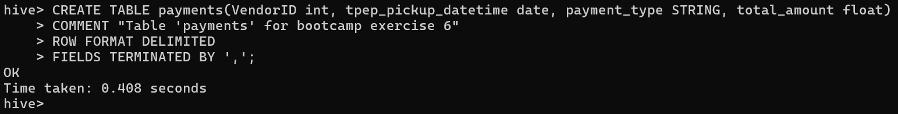
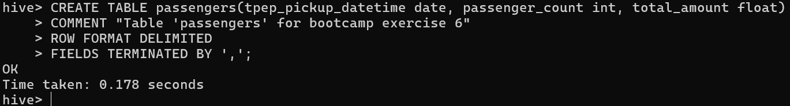
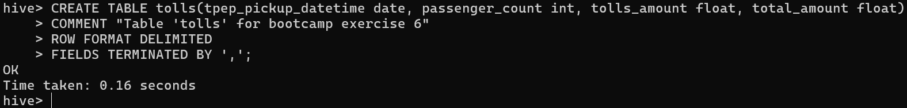
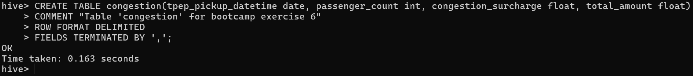
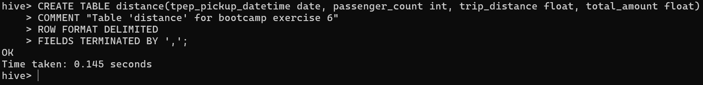
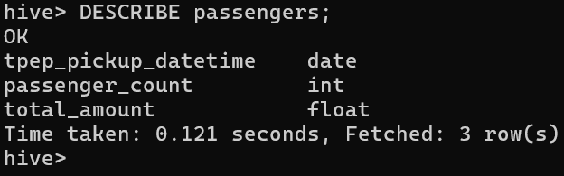
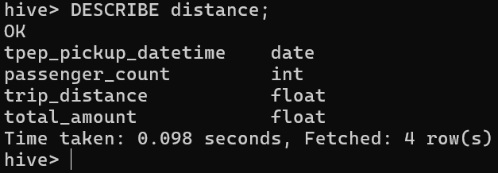
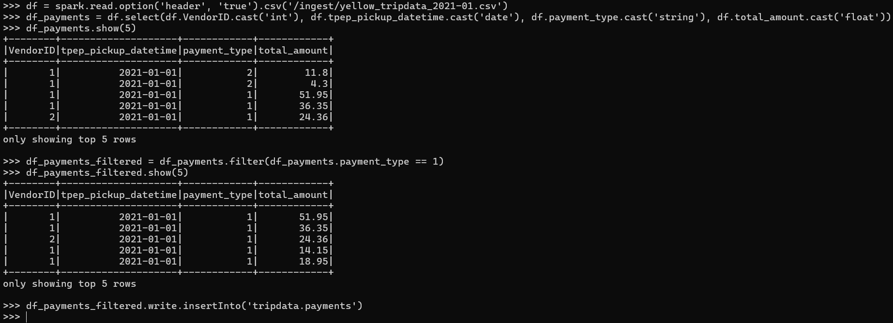

# Resolucion ejercicios

## 1. En Hive, crear las siguientes tablas (internas) en la base de datos `tripdata` en hive

* `payments(VendorID, tpep_pickup_datetime, payment_type, total_amount)`

```
CREATE TABLE payments(VendorID int, tpep_pickup_datetime date, payment_type STRING, total_amount float)
COMMENT "Table 'payments' for bootcamp exercise 6"
ROW FORMAT DELIMITED
FIELDS TERMINATED BY ',';
```



* `passengers(tpep_pickup_datetime, passenger_count, total_amount)`

```
CREATE TABLE passengers(tpep_pickup_datetime date, passenger_count int, total_amount float)
COMMENT "Table 'passengers' for bootcamp exercise 6"
ROW FORMAT DELIMITED
FIELDS TERMINATED BY ',';
```



* `tolls(tpep_pickup_datetime, passenger_count, tolls_amount, total_amount)`

```
CREATE TABLE tolls(tpep_pickup_datetime date, passenger_count int, tolls_amount float, total_amount float)
COMMENT "Table 'tolls' for bootcamp exercise 6"
ROW FORMAT DELIMITED
FIELDS TERMINATED BY ',';
```



* `congestion(tpep_pickup_datetime, passenger_count, congestion_surcharge, total_amount)`

```
CREATE TABLE congestion(tpep_pickup_datetime date, passenger_count int, congestion_surcharge float, total_amount float)
COMMENT "Table 'congestion' for bootcamp exercise 6"
ROW FORMAT DELIMITED
FIELDS TERMINATED BY ',';
```



* `distance(tpep_pickup_datetime, passenger_count, trip_distance, total_amount)`

```
CREATE TABLE distance(tpep_pickup_datetime date, passenger_count int, trip_distance float, total_amount float)
COMMENT "Table 'distance' for bootcamp exercise 6"
ROW FORMAT DELIMITED
FIELDS TERMINATED BY ',';
```



## 2. En Hive, hacer un ‘describe’ de las tablas passengers y distance

* Tabla 'passengers'

```
DESCRIBE passengers;
```



* Tabla 'distance'

```
DESCRIBE distance;
```



## 3. Hacer ingest del file: *yellow_tripdata_2021-01.csv*

HDFS

```
wget https://dataengineerpublic.blob.core.windows.net/data-engineer/yellow_tripdata_2021-01.csv
```

## 5. Insertar en la tabla payments (VendorID, tpep_pickup_datetime, payment_type, total_amount). Solamente los pagos con tarjeta de crédito.

```
df = spark.read.option('header', 'true').csv('/ingest/yellow_tripdata_2021-01.csv')
df_payments = df.select(df.VendorID.cast('int'), df.tpep_pickup_datetime.cast('date'), df.payment_type.cast('string'), df.total_amount.cast('float'))
df_payments.show(5)
df_payments_filtered = df_payments.filter(df_payments.payment_type == 1)
df_payments_filtered.show(5)
df_payments_filtered.write.insertInto('tripdata.payments')
```



## 6. Insertar en la tabla passengers (tpep_pickup_datetime, passenger_count, total_amount) los registros cuya cantidad de pasajeros sea mayor a 2 y el total del viaje cueste más de 8 dólares.

```
df = spark.read.option('header', 'true').csv('/ingest/yellow_tripdata_2021-01.csv')
df_passengers = df.select(df.tpep_pickup_datetime.cast('date'), df.passenger_count.cast('int'), df.total_amount.cast('float'))
df_passengers.show(5)
df_passengers_filtered = df_passengers.filter((df_passengers.passenger_count > 2) & (df_passengers.total_amount > 8))
df_passengers_filtered.show(5)
df_passengers_filtered.write.insertInto('tripdata.passengers')
```

