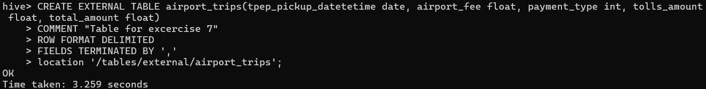
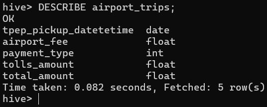

1. En Hive, crear la siguiente tabla (externa) en la base de datos `tripdata`:

```
CREATE EXTERNAL TABLE airport_trips(tpep_pickup_datetetime date, airport_fee float, payment_type string, tolls_amount float, total_amount float)
COMMENT "Table for excercise 7"
ROW FORMAT DELIMITED
FIELDS TERMINATED BY ','
location '/tables/external/airport_trips';
```



2. En Hive, mostrar el esquema de `airport_trips`

