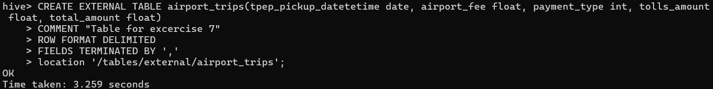
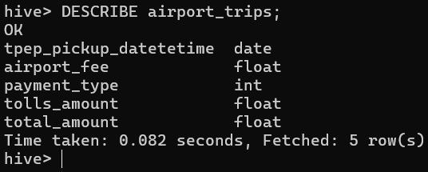
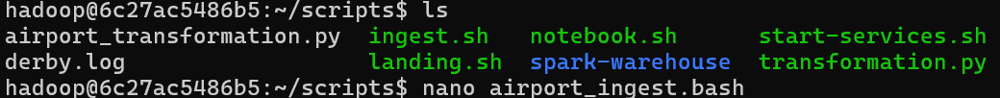
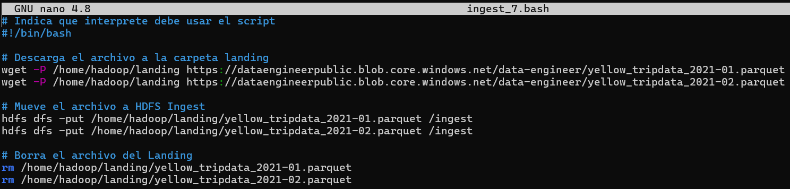
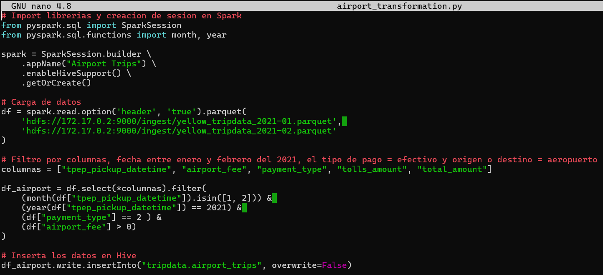
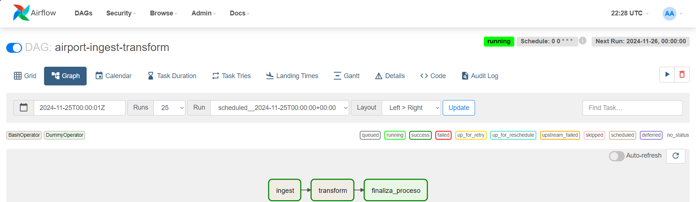
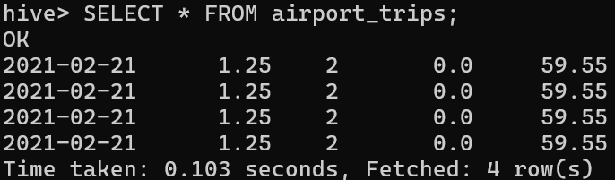

# Resolucion ejercicios

**1.** En Hive, crear la siguiente tabla (externa) en la base de datos `tripdata`:

```
CREATE EXTERNAL TABLE airport_trips(tpep_pickup_datetetime date, airport_fee float, payment_type string, tolls_amount float, total_amount float)
COMMENT "Table for excercise 7"
ROW FORMAT DELIMITED
FIELDS TERMINATED BY ','
location '/tables/external/airport_trips';
```



**2.** En Hive, mostrar el esquema de `airport_trips`

`DESCRIBE airport_trips`



**3.** Crear un archivo `.bash` que permita descargar los archivos mencionados abajo e ingestarlos en HDFS:

- Yellow_tripdata_2021-01.parquet (https://dataengineerpublic.blob.core.windows.net/data-engineer/yellow_tripdata_2021-01.parquet)
- Yellow_tripdata_2021-02.parquet (https://dataengineerpublic.blob.core.windows.net/data-engineer/yellow_tripdata_2021-02.parquet)

**Archivo `airport_ingest.py`:**

```bash
# Indica que interprete debe usar el script
#!/bin/bash

# Descarga el archivo a la carpeta landing
wget -P /home/hadoop/landing https://dataengineerpublic.blob.core.windows.net/data-engineer/yellow_tripdata_2021-01.parquet
wget -P /home/hadoop/landing https://dataengineerpublic.blob.core.windows.net/data-engineer/yellow_tripdata_2021-02.parquet

# Mueve el archivo a HDFS Ingest
hdfs dfs -put /home/hadoop/landing/yellow_tripdata_2021-01.parquet /ingest
hdfs dfs -put /home/hadoop/landing/yellow_tripdata_2021-02.parquet /ingest

# Borra el archivo del Landing
rm /home/hadoop/landing/yellow_tripdata_2021-01.parquet
rm /home/hadoop/landing/yellow_tripdata_2021-02.parquet
```





**4.** Crear un archivo `.py` que permita, mediante Spark, crear un data frame uniendo los viajes del mes 01 y mes 02 del año 2021 y luego Insertar en la tabla `airport_trips` los viajes que tuvieron como inicio o destino aeropuertos, que hayan pagado con dinero.

**Archivo `airport_transformation.py`:**

```python
# Import librerias y creacion de sesion en Spark
from pyspark.sql import SparkSession
from pyspark.sql.functions import month, year

spark = SparkSession.builder \
    .appName("Airport Trips") \
    .enableHiveSupport() \
    .getOrCreate()

# Carga de datos
df = spark.read.option('header', 'true').parquet(
    'hdfs://172.17.0.2:9000/ingest/yellow_tripdata_2021-01.parquet', 
    'hdfs://172.17.0.2:9000/ingest/yellow_tripdata_2021-02.parquet'
)

# Filtro por columnas, fecha entre enero y febrero del 2021, el tipo de pago = efectivo y origen o destino = aeropuerto
columnas = ["tpep_pickup_datetime", "airport_fee", "payment_type", "tolls_amount", "total_amount"]

df_airport = df.select(*columnas).filter(
    (month(df["tpep_pickup_datetime"]).isin([1, 2])) & 
    (year(df["tpep_pickup_datetime"]) == 2021) & 
    (df["payment_type"] == 2 ) &
    (df["airport_fee"] > 0)
)

# Inserta los datos en Hive
df_airport.write.insertInto("tripdata.airport_trips", overwrite=False)
```




**5.** Realizar un proceso automático en Airflow que orqueste los archivos creados en los puntos 3 y 4. Correrlo y mostrar una captura de pantalla (del DAG y del resultado en la base de datos).



