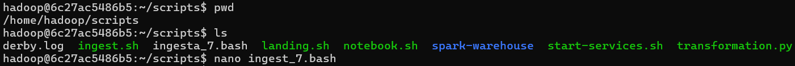
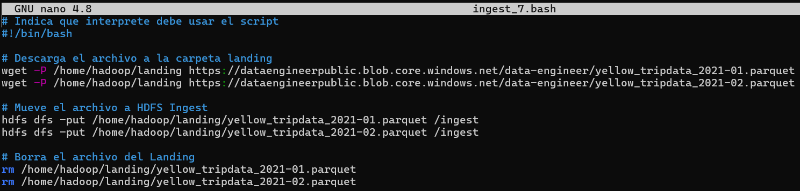

**1.** En Hive, crear la siguiente tabla (externa) en la base de datos `tripdata`:

```
CREATE EXTERNAL TABLE airport_trips(tpep_pickup_datetetime date, airport_fee float, payment_type string, tolls_amount float, total_amount float)
COMMENT "Table for excercise 7"
ROW FORMAT DELIMITED
FIELDS TERMINATED BY ','
location '/tables/external/airport_trips';
```


**2.** En Hive, mostrar el esquema de `airport_trips`

`DESCRIBE airport_trips`


**3.** Crear un archivo `.bash` que permita descargar los archivos mencionados abajo e ingestarlos en HDFS:

- Yellow_tripdata_2021-01.parquet (https://dataengineerpublic.blob.core.windows.net/data-engineer/yellow_tripdata_2021-01.parquet)
- Yellow_tripdata_2021-02.parquet (https://dataengineerpublic.blob.core.windows.net/data-engineer/yellow_tripdata_2021-02.parquet)

Archivo `.bash`:

```
# Indica que interprete debe usar el script
#!/bin/bash

# Descarga el archivo a la carpeta landing
wget -P /home/hadoop/landing https://dataengineerpublic.blob.core.windows.net/data-engineer/yellow_tripdata_2021-01.parquet
wget -P /home/hadoop/landing https://dataengineerpublic.blob.core.windows.net/data-engineer/yellow_tripdata_2021-02.parquet

# Mueve el archivo a HDFS Ingest
hdfs dfs -put /home/hadoop/landing/yellow_tripdata_2021-01.parquet /ingest
hdfs dfs -put /home/hadoop/landing/yellow_tripdata_2021-02.parquet /ingest

# Borra el archivo del Landing
rm /home/hadoop/landing/yellow_tripdata_2021-01.parquet
rm /home/hadoop/landing/yellow_tripdata_2021-02.parquet
```



