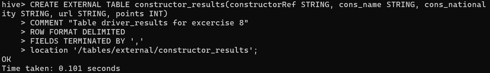
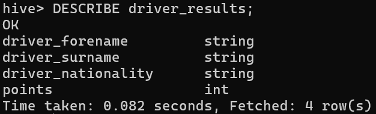
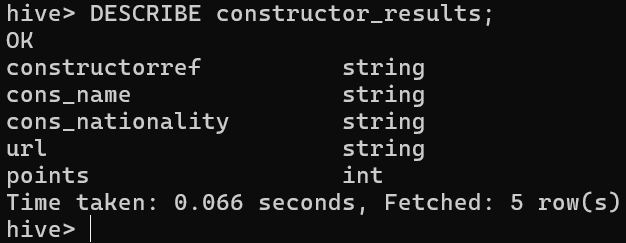
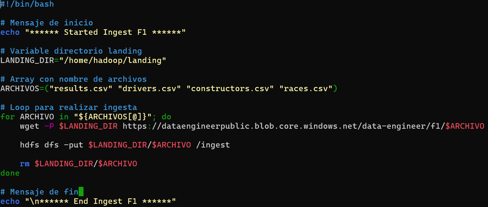

## Resolucion ejercicios

### **1.** Crear la siguientes tablas externas en la base de datos f1 en hive:
    a. `driver_results (driver_forename, driver_surname, driver_nationality, points)`
    b. `constructor_results (constructorRef, cons_name, cons_nationality, url, points)`

```bash
CREATE EXTERNAL TABLE driver_results(driver_forename STRING, driver_surname STRING, driver_nationality STRING, points INT)
COMMENT "Table driver_results for excercise 8"
ROW FORMAT DELIMITED
FIELDS TERMINATED BY ','
location '/tables/external/driver_results';
```


```bash
CREATE EXTERNAL TABLE constructor_results(constructorRef STRING, cons_name STRING, cons_nationality STRING, url STRING, points INT)
COMMENT "Table driver_results for excercise 8"
ROW FORMAT DELIMITED
FIELDS TERMINATED BY ','
location '/tables/external/constructor_results';
```



### **2.** En Hive, mostrar el esquema de `driver_results` y `constructor_results`

Esquema `driver_results`:



Esquema `constructor_results`:



### **3.** Crear un archivo .bash que permita descargar los archivos mencionados abajo e ingestarlos en HDFS:

- `results.csv`
https://dataengineerpublic.blob.core.windows.net/data-engineer/f1/results.csv

- `drivers.csv`
https://dataengineerpublic.blob.core.windows.net/data-engineer/f1/drivers.csv

- `constructors.csv`
https://dataengineerpublic.blob.core.windows.net/data-engineer/f1/constructors.csv

- `races.csv`
https://dataengineerpublic.blob.core.windows.net/data-engineer/f1/races.csv

**Archivo `f1_ingeset.bash`:**

```bash
#!/bin/bash

# Mensaje de inicio
#!/bin/bash

# Mensaje de inicio
echo "****** Started Ingest F1 ******"

# Variable directorio landing
LANDING_DIR="/home/hadoop/landing"

# Array con nombre de archivos
ARCHIVOS=("results.csv" "drivers.csv" "constructors.csv" "races.csv")

# Loop para realizar ingesta
for ARCHIVO in "${ARCHIVOS[@]}"; do
    wget -P $LANDING_DIR https://dataengineerpublic.blob.core.windows.net/data-engineer/f1/$ARCHIVO

    hdfs dfs -put $LANDING_DIR/$ARCHIVO /ingest

    rm $LANDING_DIR/$ARCHIVO
done

# Mensaje de fin
echo "\n****** End Ingest F1 ******"
```


