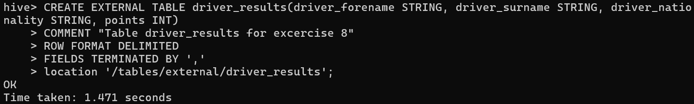
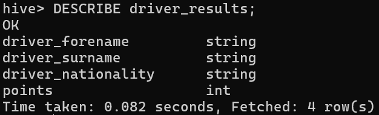
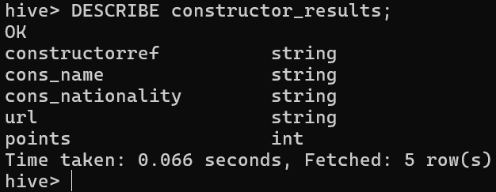
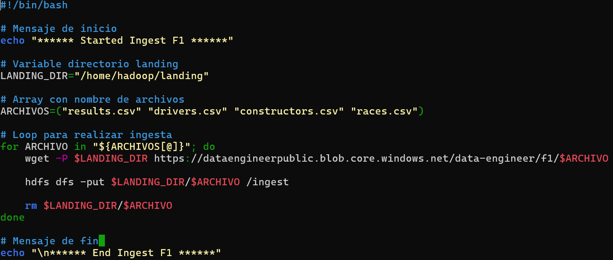
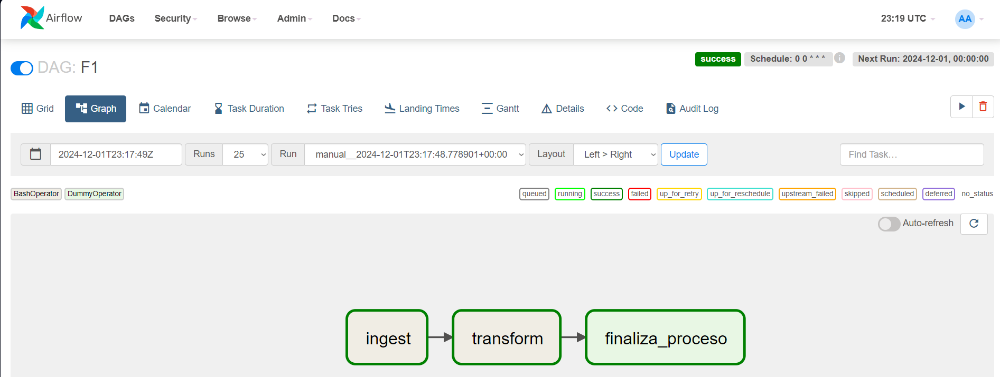
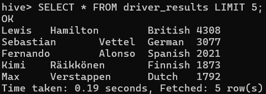
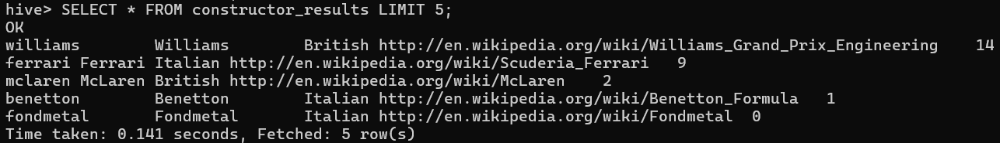

## Resolucion ejercicios

### **1.** Crear la siguientes tablas externas en la base de datos f1 en hive:
    a. `driver_results (driver_forename, driver_surname, driver_nationality, points)`
    b. `constructor_results (constructorRef, cons_name, cons_nationality, url, points)`

```bash
CREATE EXTERNAL TABLE driver_results(driver_forename STRING, driver_surname STRING, driver_nationality STRING, points INT)
COMMENT "Table driver_results for excercise 8"
ROW FORMAT DELIMITED
FIELDS TERMINATED BY ','
location '/tables/external/driver_results';
```



```bash
CREATE EXTERNAL TABLE constructor_results(constructorRef STRING, cons_name STRING, cons_nationality STRING, url STRING, points INT)
COMMENT "Table driver_results for excercise 8"
ROW FORMAT DELIMITED
FIELDS TERMINATED BY ','
location '/tables/external/constructor_results';
```


### **2.** En Hive, mostrar el esquema de `driver_results` y `constructor_results`

Esquema `driver_results`:



Esquema `constructor_results`:



### **3.** Crear un archivo .sh que permita descargar los archivos mencionados abajo e ingestarlos en HDFS:

- `results.csv`
https://dataengineerpublic.blob.core.windows.net/data-engineer/f1/results.csv

- `drivers.csv`
https://dataengineerpublic.blob.core.windows.net/data-engineer/f1/drivers.csv

- `constructors.csv`
https://dataengineerpublic.blob.core.windows.net/data-engineer/f1/constructors.csv

- `races.csv`
https://dataengineerpublic.blob.core.windows.net/data-engineer/f1/races.csv

**Archivo `f1_ingeset.sh`:**

```bash
#!/bin/bash

# Mensaje de inicio
#!/bin/bash

# Mensaje de inicio
echo "****** Started Ingest F1 ******"

# Variable directorio landing
LANDING_DIR="/home/hadoop/landing"

# Array con nombre de archivos
ARCHIVOS=("results.csv" "drivers.csv" "constructors.csv" "races.csv")

# Loop para realizar ingesta
for ARCHIVO in "${ARCHIVOS[@]}"; do
    wget -P $LANDING_DIR https://dataengineerpublic.blob.core.windows.net/data-engineer/f1/$ARCHIVO

    hdfs dfs -put $LANDING_DIR/$ARCHIVO /ingest

    rm $LANDING_DIR/$ARCHIVO
done

# Mensaje de fin
echo "\n****** End Ingest F1 ******"
```




### **4.** Generar un archivo .py que permita, mediante Spark:
    a. insertar en la tabla driver_results los corredores con mayor cantidad de puntos en la historia.
    b. insertar en la tabla constructor_result quienes obtuvieron más puntos en el Spanish Grand Prix en el año 1991

```python
# Import librerias y creacion de sesion en Spark
from pyspark.sql import SparkSession
from pyspark.sql.functions import year, sum

spark = SparkSession.builder \
    .appName("F1") \
    .enableHiveSupport() \
    .getOrCreate()

# Carga de datos
constructors = spark.read.option('header', 'true').csv('hdfs://172.17.0.2:9000/ingest/constructors.csv')
drivers = spark.read.option('header', 'true').csv('hdfs://172.17.0.2:9000/ingest/drivers.csv')
races = spark.read.option('header', 'true').csv('hdfs://172.17.0.2:9000/ingest/races.csv')
results = spark.read.option('header', 'true').csv('hdfs://172.17.0.2:9000/ingest/results.csv')

# Seleccion y casting de columnas necesarias
drivers_mod = drivers.select(drivers.driverId.cast("int"), drivers.forename, drivers.surname, drivers.nationality)

races_mod = races.select(races["raceId"].cast("int"), races["year"].cast("date"), "name")

constructors_mod = constructors.select(constructors['constructorId'].cast("int"), 'constructorRef', 'name', 'nationality', 'url')

results_mod = results.select(results["resultId"].cast("int"), results["raceId"].cast("int"), results["driverId"].cast("int"), results["constructorId"].cast("int"), results["points"].cast("int"))

# --------------------------------------------------------------------------------------------------------------------------------------------------------------------------------------------------

# Insertar en la tabla driver_results los corredores con mayor cantidad de puntos en la historia.

# Seleccion columnas driverId y points de la tabla results
results_drivers = results_mod.select('driverId', 'points')

# Union tabla results & drivers
driver_results = drivers_mod.join(results_drivers, how="inner", on="driverId")

# Agrupacion segun conductores ordenado segun puntos
top_drivers = driver_results.groupby("forename", "surname", "nationality").agg({"points":"sum"}).orderBy("sum(points)", ascending=False)

# Inserta los datos en la BD f1, tabla 'drver_results'
top_drivers.write.insertInto("f1.driver_results")

# --------------------------------------------------------------------------------------------------------------------------------------------------------------------------------------------------

# Insertar en la tabla constructor_result quienes obtuvieron más puntos en el Spanish Grand Prix en el año 1991.

# Obtencion de raceId del Spanish Grand Prix de 1991
race_91 = races_mod.filter((races_mod['name'] == "Spanish Grand Prix") & (year(races_mod['year']) == 1991)).select('raceId')

# Seleccion columnas de resultados
results_cons = results_mod.select('raceId', 'constructorId', 'points')

# Union tabla results con raceId del spanish grand prix del 91 y constructores
result_91 = results_cons.join(race_91, on="raceId", how="inner").join(constructors_mod, on="constructorId", how="inner").drop("raceId", "constructorId")

# Agrupacion por constructor y sus puntos en el Spanish Gran Prix de 1991
constructors_results = result_91.groupby("constructorRef", "name", "nationality", "url").agg({"points":"sum"}).orderBy("sum(points)", ascending=False)

# Inserta resultados en la BD f1, en la tabla constructor_results
constructors_results.write.insertInto("f1.constructor_results")
```

5. Realizar un proceso automático en Airflow que orqueste los archivos creados en los puntos 3 y 4. Correrlo y mostrar una captura de pantalla (del DAG y del resultado en la base de datos)

**Archivo `f1_dag.py`**

```python
from datetime import timedelta
from airflow import DAG
from airflow.operators.bash import BashOperator
from airflow.operators.dummy import DummyOperator
from airflow.utils.dates import days_ago

args = {
    'owner': 'airflow',
}

with DAG(
    dag_id='F1',
    default_args=args,
    schedule_interval='0 0 * * *',
    start_date=days_ago(2),
    dagrun_timeout=timedelta(minutes=60),
    tags=['ingest', 'transform'],
    params={"example_key": "example_value"},
) as dag:

    finaliza_proceso = DummyOperator(
        task_id='finaliza_proceso',
    )


    ingest = BashOperator(
        task_id='ingest',
        bash_command='/usr/bin/sh /home/hadoop/scripts/f1_ingest.sh ',
    )


    transform = BashOperator(
        task_id='transform',
        bash_command='ssh hadoop@172.17.0.2 /home/hadoop/spark/bin/spark-submit --files /home/hadoop/hive/conf/hive-site.xml /home/hadoop/scripts/f1_transformation.py ',
    )


    ingest >> transform >>finaliza_proceso

if __name__ == "__main__":
    dag.cli()
```





