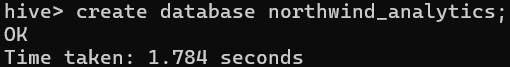

## Resolucion ejercitacion 9

1. Crear una base de datos en Hive llamada `northwind_analytics`



2. Crear un script para importar un archivo .parquet de la base northwind que contenga la lista de clientes junto a la cantidad de productos vendidos ordenados de mayor a menor (campos customer_id, company_name, productos_vendidos). Luego ingestar el archivo a HDFS (carpeta /sqoop/ingest/clientes). Pasar la password en un archivo.

```
sqoop import \
    --connect jdbc:postgresql://172.17.0.3:5432/northwind \
    --username postgres \
    --password-file file:///home/hadoop/scripts/sqoop.pass \
    --query "SELECT c.customer_id, c.company_name, od.quantity AS productos_vendidos FROM customers c INNER JOIN orders o ON o.customer_id = c.customer_id INNER JOIN order_details od ON od.order_id = o.order_id WHERE \$CONDITIONS ORDER BY od.quantity DESC" \
    --m 1 \
    --target-dir /sqoop/ingest/clientes \
    --as-parquetfile \
    --delete-target-dir
```

3. Crear un script para importar un archivo .parquet de la base northwind que contenga la lista de órdenes junto a qué empresa realizó cada pedido (campos order_id, shipped_date, company_name, phone). Luego ingestar el archivo a HDFS (carpeta /sqoop/ingest/envíos). Pasar la password en un archivo.

```
sqoop import \
    --connect jdbc:postgresql://172.17.0.3:5432/northwind \
    --username postgres\
    --password-file file:///home/hadoop/scripts/sqoop.pass \
    --query "SELECT o.order_id, o.shipped_date, c.company_name, c.phone FROM orders o INNER JOIN customers c ON c.customer_id = o.customer_id AND \$CONDITIONS" \
    --m 1 \
    --target-dir /sqoop/ingest/envios \
    --as-parquetfile \
    --delete-target-dir
```

4. Crear un script para importar un archivo .parquet de la base northwind que contenga la lista de detalles de órdenes (campos order_id, unit_price, quantity, discount). Luego ingestar el archivo a HDFS (carpeta /sqoop/ingest/order_details). Pasar la password en un archivo

```
sqoop import \
    --connect jdbc:postgresql://172.17.0.3:5432/northwind \
    --username postgres\
    --password-file file:///home/hadoop/scripts/sqoop.pass \
    --query "SELECT od.order_id, od.unit_price, od.quantity, od.discount FROM order_details od WHERE \$CONDITIONS" \
    --m 1 \
    --target-dir /sqoop/ingest/order_details \
    --as-parquetfile \
    --delete-target-dir
```

5. Generar un archivo .py que permita mediante `Spark` insertar en `Hive` en la db `northwind_analytics` en la tabla `products_sold`, los datos del punto 2, pero solamente aquellas compañías en las que la cantidad de productos vendidos fue mayor al promedio.

```python
```

6. Generar un archivo .py que permita mediante `Spark` insertar en `Hive` en la tabla `products_sent`, los datos del punto 3 y 4, de manera tal que se vean las columnas (`order_id, shipped_date, company_name, phone, unit_price_discount (unit_price with discount), quantity, total_price unit_price_discount * quantity`). Solo de aquellos pedidos que hayan tenido descuento.

```python
```

7. Realizar un proceso automático en `Airflow` que orqueste los pipelines creados en los puntos anteriores. Crear un grupo para la etapa de ingest y otro para la etapa de process. Correrlo y mostrar una captura de pantalla (del DAG y del resultado en la base de datos)

```python
```