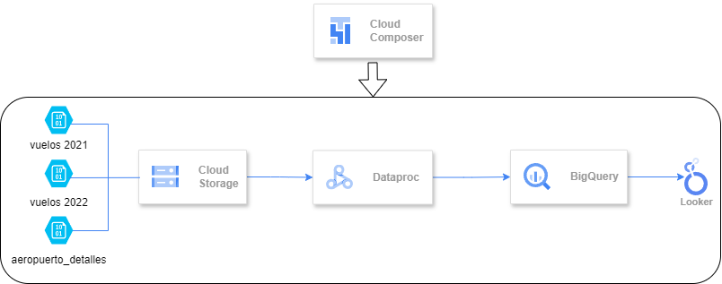

<div align="center">
  
  
  <h3>Aviacion Civil</h3>
</div>

*La Administración Nacional de Aviación Civil necesita una serie de informes para elevar al ministerio de transporte acerca de los aterrizajes y despegues en todo el territorio Argentino, como puede ser: cuales aviones son los que más volaron, cuántos pasajeros volaron, ciudades de partidas y aterrizajes entre fechas determinadas, etc.*

*Usted como data engineer deberá realizar un pipeline con esta información, automatizarlo y realizar los análisis de datos solicitados que permita responder las preguntas de negocio, y hacer sus recomendaciones con respecto al estado actual.*

Listado de vuelos realizados:
https://datos.gob.ar/lv/dataset/transporte-aterrizajes-despegues-procesados-por-administracionnacional-aviacion-civil-anac


Listado de detalles de aeropuertos de Argentina:
https://datos.transporte.gob.ar/dataset/lista-aeropuertos

<h1>TAREAS</h1>

### **1.** Hacer ingest de los siguientes files relacionados con transporte aéreo de Argentina:

2021:
https://dataengineerpublic.blob.core.windows.net/data-engineer/2021-informe-ministerio.csv

2022:
https://dataengineerpublic.blob.core.windows.net/data-engineer/202206-informe-ministerio.csv

Aeropuertos_detalles:
https://dataengineerpublic.blob.core.windows.net/data-engineer/aeropuertos_detalle.csv

```
nano aviacion_ingest.sh
```


**Archivo** `aviacion_ingest.sh`:

```bash
#!/bin/bash

# Mensaje de inicio
echo "****** Inicio Ingesta Aviacion Civil ******"

# Directorio landing en hadoop
LANDING_DIR="/home/hadoop/landing"

# Directorio destino en HDFS
DEST_DIR="/ingest"

# Nombre archivos
VUELOS_2021="2021-informe-ministerio.csv"
VUELOS_2022="202206-informe-ministerio.csv"
AEROPUERTOS="aeropuertos_detalle.csv"

# Descarga archivos
wget -P $LANDING_DIR https://dataengineerpublic.blob.core.windows.net/data-engineer/$VUELOS_2021
wget -P $LANDING_DIR https://dataengineerpublic.blob.core.windows.net/data-engineer/$VUELOS_2022
wget -P $LANDING_DIR https://dataengineerpublic.blob.core.windows.net/data-engineer/$AEROPUERTOS

# Mover archivos a HDFS
hdfs dfs -put $LANDING_DIR/$VUELOS_2021 $DEST_DIR
hdfs dfs -put $LANDING_DIR/$VUELOS_2022 $DEST_DIR
hdfs dfs -put $LANDING_DIR/$AEROPUERTOS $DEST_DIR

# Remueve archivos
rm $LANDING_DIR/$VUELOS_2021
rm $LANDING_DIR/$VUELOS_2022
rm $LANDING_DIR/$AEROPUERTOS

# Mensaje de finalizacion
echo "\n****** Fin Ingesta Aviacion Civil ******"
```

Genera permisos de lectura y de ejecución para el archivo `aviacion_ingest.sh`:

```
chmod 555 aviacion_ingest.sh
```


### **2.** Crear 2 tablas en el datawarehouse, una para los vuelos realizados en 2021 y 2022 (2021-informe-ministerio.csv y 202206-informe-ministerio) y otra tabla para el detalle de los aeropuertos (aeropuertos_detalle.csv).

Creacion base de datos `aviacion`:

```bash
CREATE DATABASE aviacion;
```

Creacion tabla `aeropuerto_tabla`:

```bash
CREATE EXTERNAL TABLE aeropuerto_tabla(
    fecha DATE,
    houraUTC string,
    clase_de_vuelo STRING,
    clasificacion_de_vuelo STRING,
    tipo_de_movimiento STRING,
    aeropuerto STRING,
    origen_destino STRING,
    aerolinea_nombre STRING,
    aeronave STRING,
    pasajeros INT
    )
COMMENT "Tabla aeropuerto_tabla para examen final ejercicio 1"
ROW FORMAT DELIMITED
FIELDS TERMINATED BY ','
location '/tables/external/aeropuerto_tabla';
```


Crea tabla `aeropuerto_detalles_tabla`:

```bash
CREATE EXTERNAL TABLE aeropuerto_detalles_tabla(
    aeropuerto STRING,
    oac STRING,
    iata STRING,
    tipo STRING,
    denominacion STRING,
    coordenadas STRING,
    latitud STRING,
    longitud STRING,
    elev FLOAT,
    uom_elev STRING,
    ref STRING,
    distancia_ref FLOAT,
    direccion_ref STRING,
    condicion STRING,
    control STRING,
    region STRING,
    uso STRING,
    trafico STRING,
    sna STRING,
    concesionado STRING,
    provincia STRING
    )
COMMENT "Tabla aeropuerto_detalles_tabla para examen final ejercicio 1"
ROW FORMAT DELIMITED
FIELDS TERMINATED BY ','
location '/tables/external/aeropuerto_detalles_tabla';
```


### **3.** Realizar un proceso automático orquestado por airflow que ingeste los archivos previamente mencionados entre las fechas *01/01/2021* y *30/06/2022* en las dos tablas creadas.

Los archivos `202206-informe-ministerio.csv` y `202206-informe-ministerio.csv` → en la tabla `aeropuerto_tabla`.

El archivo aeropuertos_detalle.csv → en la tabla `aeropuerto_detalles_tabla`.

Archivo `aviacion_dag.py`:

```python
from datetime import timedelta
from airflow import DAG
from airflow.operators.bash import BashOperator
from airflow.operators.dummy import DummyOperator
from airflow.utils.dates import days_ago

args = {
    'owner': 'airflow',
}

with DAG(
    dag_id='Aviacion',
    default_args=args,
    schedule_interval='0 0 * * *',
    start_date=days_ago(1),
    catchup=False,
    dagrun_timeout=timedelta(minutes=60),
    tags=['ingest', 'transform'],
    params={"example_key": "example_value"},
) as dag:
    
    inicia_proceso = DummyOperator(
        task_id='inicia_proceso',
    )

    finaliza_proceso = DummyOperator(
        task_id='finaliza_proceso',
    )

    ingest = BashOperator(
        task_id='ingesta',
        bash_command='/usr/bin/sh /home/hadoop/scripts/aviacion_ingest.sh ',
    )

    transform = BashOperator(
        task_id='transformacion',
        bash_command='ssh hadoop@172.17.0.2 /home/hadoop/spark/bin/spark-submit --files /home/hadoop/hive/conf/hive-site.xml /home/hadoop/scripts/aviacion_transformacion.py ',
    )

    inicia_proceso >> ingest >> transform >>finaliza_proceso

if __name__ == "__main__":
    dag.cli()
```


### **4.** Realizar las siguiente transformaciones en los pipelines de datos:
* Eliminar la columna inhab ya que no se utilizará para el análisis
* Eliminar la columna fir ya que no se utilizará para el análisis
* Eliminar la columna “calidad del dato” ya que no se utilizará para el análisis
* Filtrar los vuelos internacionales ya que solamente se analizarán los vuelos domésticos
* En el campo pasajeros si se encuentran campos en Null convertirlos en 0 (cero)
* En el campo distancia_ref si se encuentran campos en Null convertirlos en 0 (cero)

Creacion de archivo `aviacion_transformacion.py`:


```python
# Import librerias y creacion de sesion en Spark
from pyspark.sql import SparkSession
from pyspark.sql import functions as F

spark = SparkSession.builder \
    .appName("Aviacion") \
    .enableHiveSupport() \
    .getOrCreate()

# Carga de datos
vuelos_2021 = spark.read.option('header', 'true').option('sep', ';').csv('hdfs://172.17.0.2:9000/ingest/2021-informe-ministerio.csv')
vuelos_2022 = spark.read.option('header', 'true').option('sep', ';').csv('hdfs://172.17.0.2:9000/ingest/202206-informe-ministerio.csv')
aeropuertos = spark.read.option('header', 'true').option('sep', ';').csv('hdfs://172.17.0.2:9000/ingest/aeropuertos_detalle.csv')

# Union vuelos 2021 y 2022
vuelos = vuelos_2021.union(vuelos_2022)

# Tabla vuelos
# Casting de las columnas "Fecha" y "Pasajeros"
# Unifica los valores de columna "Clasificacion Vuelo" a "Domestico"
vuelos_mod = vuelos \
    .withColumn("Pasajeros", F.col("Pasajeros").cast("int")) \
    .withColumn("Fecha", F.to_date(vuelos["Fecha"], "dd/MM/yyyy").alias("Fecha")) \
    .replace({'Doméstico': 'Domestico'}, subset=['Clasificación Vuelo'])

# Tabla vuelos
# Filtra por vuelos domesticos, elimina columna 'calidad del dato' y reemplaza nulos de la columna 'pasajeros' por ceros
vuelos_mod_domesticos_filtered = vuelos_mod \
    .filter(vuelos_mod['Clasificación Vuelo'] == "Domestico") \
    .drop('Calidad dato') \
    .fillna(0, 'pasajeros')

# Tabla aeropuertos_detalle
# Casting de variables elev y distancia_ref
aeropuertos_mod = aeropuertos \
    .withColumn("elev", aeropuertos["elev"].cast("float")) \
    .withColumn("distancia_ref", aeropuertos["distancia_ref"].cast("float"))

# Tabla aeropuertos_detalle
# Elimina columnas 'inhab', 'fir' y reemplaza nulos de la columna 'distancia_ref' por ceros. 
aeropuertos_transformado = aeropuertos_mod \
    .fillna(0, "distancia_ref") \
    .drop('inhab', 'fir')

# Inserta tabla "vuelos_mod_domesticos_filtered" en la BD aviacion, en la tabla 'aeropuerto_tabla'
vuelos_mod_domesticos_filtered.write.insertInto("aviacion.aeropuerto_tabla")

# Inserta tabla "detalle_aeropuertos" en la BD aviacion, en la tabla 'aeropuerto_detalles_tabla'
aeropuertos_transformado.write.insertInto("aviacion.aeropuerto_detalles_tabla")
```


### **5.** Mostrar mediante una impresión de pantalla, que los tipos de campos de las tablas sean los solicitados en el datawarehouse (ej: fecha date, aeronave string, pasajeros integer, etc.)

Esquema tabla `aeropuerto_tabla`:


Esquema tabla `aeropuerto_detalles_tabla`:


### **6.** Determinar la cantidad de vuelos entre las fechas 01/12/2021 y 31/01/2022. Mostrar consulta y Resultado de la query

```sql
SELECT count(AT.fecha) AS cantidad_vuelos
FROM aeropuerto_tabla AT
WHERE AT.fecha BETWEEN "2021-12-01" AND "2022-01-31";
```


### **7.** Cantidad de pasajeros que viajaron en Aerolíneas Argentinas entre el 01/01/2021 y 30/06/2022. Mostrar consulta y Resultado de la query

```sql
SELECT SUM(AT.pasajeros) AS cantidad_pasajeros
FROM aeropuerto_tabla AT
WHERE 
	AT.aerolinea_nombre = "AEROLINEAS ARGENTINAS SA" AND
	AT.fecha BETWEEN "2021-01-01" AND "2022-06-30";
```


### **8.** Mostrar fecha, hora, código aeropuerto salida, ciudad de salida, código de aeropuerto de arribo, ciudad de arribo, y cantidad de pasajeros de cada vuelo, entre el 01/01/2022 y el 30/06/2022 ordenados por fecha de manera descendiente. Mostrar consulta y Resultado de la query

```sql
-- Vuelos de salida con su ciudad
CREATE VIEW vuelos_salida AS
SELECT 
  at.fecha,
  at.hourautc,
  at.aeropuerto_salida AS `codigo_aeropuerto_salida`,
  adt.REF AS `ciudad_de_salida`,
  at.pasajeros
FROM (
  SELECT 
    AT.fecha,
    AT.hourautc,
    AT.aeropuerto AS `aeropuerto_salida`,
    AT.pasajeros
  FROM aeropuerto_tabla AT
  WHERE AT.fecha BETWEEN "2022-01-01" AND "2022-06-30"
  AND AT.tipo_de_movimiento = "Despegue"
  UNION
  SELECT 
    AT.fecha,
    AT.hourautc,
    AT.origen_destino AS `aeropuerto_salida`,
    AT.pasajeros
  FROM aeropuerto_tabla AT
  WHERE AT.fecha BETWEEN "2022-01-01" AND "2022-06-30"
  AND AT.tipo_de_movimiento = "Aterrizaje"
) at
INNER JOIN aeropuerto_detalles_tabla adt
ON adt.aeropuerto = at.aeropuerto_salida;

-- Vuelos de arribo con su ciudad
CREATE VIEW vuelos_arribo AS
SELECT 
  at.fecha,
  at.hourautc,
  at.aeropuerto_arribo AS `codigo_aeropuerto_arribo`,
  adt.REF AS `ciudad_de_arribo`,
  at.pasajeros
FROM (
  SELECT 
    AT.fecha,
    AT.hourautc,
    AT.aeropuerto AS `aeropuerto_arribo`,
    AT.pasajeros
  FROM aeropuerto_tabla AT
  WHERE AT.fecha BETWEEN "2022-01-01" AND "2022-06-30"
  AND AT.tipo_de_movimiento = "Aterrizaje"
  UNION
  SELECT 
    AT.fecha,
    AT.hourautc,
    AT.origen_destino AS `aeropuerto_arribo`,
    AT.pasajeros
  FROM aeropuerto_tabla AT
  WHERE AT.fecha BETWEEN "2022-01-01" AND "2022-06-30"
  AND AT.tipo_de_movimiento = "Despegue"
) at
INNER JOIN aeropuerto_detalles_tabla adt
ON adt.aeropuerto = at.aeropuerto_arribo;

-- union vuelos salida con vuelos arribo con fecha, hora y pasajeros
SELECT
	vs.fecha,
	vs.hourautc,
	vs.codigo_aeropuerto_salida,
	vs.ciudad_de_salida,
	va.codigo_aeropuerto_arribo,
	va.ciudad_de_arribo,
	vs.pasajeros + va.pasajeros AS `pasajeros`
FROM vuelos_salida vs
INNER JOIN vuelos_arribo va
ON vs.fecha = va.fecha
AND vs.hourautc = va.hourautc
ORDER BY fecha DESC;
```


### **9.** Cuales son las 10 aerolíneas que más pasajeros llevaron entre el 01/01/2021 y el 30/06/2022 exceptuando aquellas aerolíneas que no tengan nombre. Mostrar consulta y Visualización.

```sql
SELECT 
	RANK() OVER (ORDER BY SUM(AT.pasajeros) DESC) AS Rank,
	AT.aerolinea_nombre,
	SUM(AT.pasajeros) AS cantidad_pasajeros
FROM aeropuerto_tabla AT
WHERE AT.fecha BETWEEN "2021-01-01" AND "2022-06-30"
AND (AT.aerolinea_nombre IS NOT NULL) AND (AT.aerolinea_nombre <> "0")
GROUP BY AT.aerolinea_nombre
LIMIT 10;
```


### **10.** Cuales son las 10 aeronaves más utilizadas entre el 01/01/2021 y el 30/06/22 que despegaron desde la Ciudad autónoma de Buenos Aires o de Buenos Aires, exceptuando aquellas aeronaves que no cuentan con nombre. Mostrar consulta y Visualización

```sql
SELECT
    aeronave,
    COUNT(*) AS cantidad_de_vuelos
FROM  aeropuerto_tabla
WHERE 
    fecha BETWEEN '2021-01-01' AND '2022-06-30'
    AND aeropuerto IN (
        SELECT 
            aeropuerto
        FROM 
            aeropuerto_detalles_tabla
        WHERE 
            provincia IN ('CIUDAD AUTÓNOMA DE BUENOS AIRES', 'BUENOS AIRES')
    )
    AND (aeronave IS NOT NULL) 
    AND (aeronave <> "0")
GROUP BY aeronave
ORDER BY cantidad_de_vuelos DESC
LIMIT 10;
```


### **11.** Qué datos externos agregaría en este dataset que mejoraría el análisis de los datos

Para mejorar el análisis, agregaría los siguientes datos:
* Información detallada sobre los pasajeros, como el número de pasajeros que viajaron efectivamente, cancelaciones y, si es posible, la demora y el motivo de la cancelación.
* Datos sobre el estado del vuelo (cancelado o no) y el pronóstico meteorológico correspondiente, para analizar si las cancelaciones se deben principalmente a causas climáticas u otras razones.
* Una tabla adicional con información sobre los precios de los pasajes para cada aerolínea y categoría de servicio, así como datos sobre la antigüedad de las aeronaves de cada aerolínea. Esto me permitiría estimar cuál es la mejor opción en términos de precio y calidad, o identificar servicios más económicos o exclusivos.
* Por último, datos sobre puentes turísticos y su impacto en la demanda de vuelos. Sería interesante analizar si hubo un aumento significativo en la cantidad de vuelos durante años con más puentes turísticos, y cómo esto afectó la oferta y la demanda en el mercado aéreo.

### **12.** Elabore sus conclusiones y recomendaciones sobre este proyecto.

El objetivo principal de este proyecto es demostrar la capacidad y conocimiento analítico requerido para un Data Engineer, abarcando desde la gestión de consola hasta la implementación de un pipeline completo y funcional

Además, el proyecto pone a prueba la capacidad de resolver problemas de negocio. No solamente en cuanto a lo técnico, sino también en cuanto a lo analítico sobre el análisis sobre la base de datos que que se brindó.

Mis recomendaciones para mejorar el proyecto es, hacer un tratado más profundo de la base de datos de forma tal que se remuevan todos los valores que podrían generar un problema a futuro como los nulos ó valores "0" en todas las entradas ya que, no solamente supone un retraso en el análisis, sino también que no corresponde en cuanto a un pipeline transformar los datos en el momento de la explotación de datos.

Sugiero una mejora en la base de datos de "_Listado de vuelos realizados_". Sería muy útil cambiar el esquema mismo de la tabla tal que, en la misma entrada, se pueda ver de donde sale el vuelo, el horario de salida, el destino y el horario de llegada estimado. Además se evitaría la mala práctica de tener que realizar tarnsformaciones en el momento de la explotación de datos. Por último, agregaría una variable que diga si el vuelo fue realizado en el horario estipulado ó si fué reprogramado ó cancelado.

### **13.** Proponer una arquitectura alternativa para este proceso ya sea con herramientas on premise o cloud (Sí aplica)

Propongo una arquitectura alternativa también de tipo Batch en Cloud:


