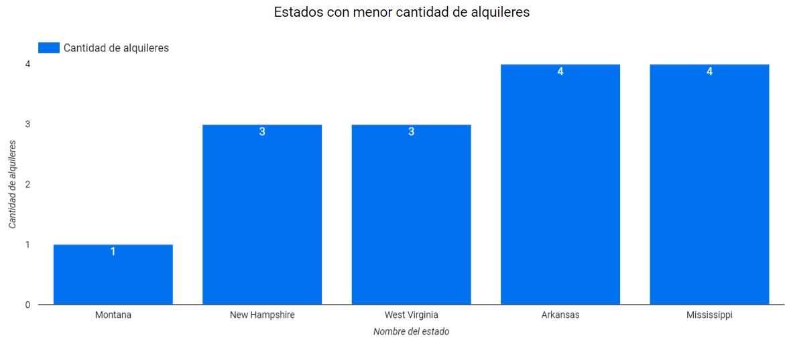

<div align="center">
  <h1>Ejercicio 2</h1>
  <h3>Alquiler de automóviles</h3>
</div>

Una de las empresas líderes en alquileres de automóviles solicita una serie de dashboards y reportes para poder basar sus decisiones en datos. Entre los indicadores mencionados se encuentran total de alquileres, segmentación por tipo de combustible, lugar, marca y modelo de automóvil, valoración de cada alquiler, etc.

Como Data Engineer debe crear y automatizar el pipeline para tener como resultado los datos listos para ser visualizados y responder las preguntas de negocio.

**1.** Crear en `hive` una database `car_rental_db` y dentro una tabla llamada `car_rental_analytics`, con estos campos:

<div align="center">
    <table>
        <tr>
            <th>Campo</th>
            <th>Tipo</th>
        </tr>
        <tr>
            <td>fuelType</td>
            <td>string</td>
        </tr>
        <tr>
            <td>rating</td>
            <td>integer</td>
        </tr>
        <tr>
            <td>renterTripsTaken</td>
            <td>integer</td>
        </tr>
        <tr>
            <td>reviewCount</td>
            <td>integer</td>
        </tr>
        <tr>
            <td>city</td>
            <td>string</td>
        </tr>
        <tr>
            <td>state_name</td>
            <td>string</td>
        </tr>
        <tr>
            <td>owner_id</td>
            <td>integer</td>
        </tr>
        <tr>
            <td>rate_daily</td>
            <td>integer</td>
        </tr>
        <tr>
            <td>make</td>
            <td>string</td>
        </tr>
        <tr>
            <td>model</td>
            <td>string</td>
        </tr>
        <tr>
            <td>year</td>
            <td>integer</td>
        </tr>
    </table>
</div>

```SQL
CREATE DATABASE car_rental_db;
```

```bash
CREATE EXTERNAL TABLE car_rental_analytics(
    fuelType STRING,
    rating INTEGER,
    renterTripsTaken INTEGER,
    reviewCount INTEGER,
    city STRING,
    state_name STRING,
    owner_id INTEGER,
    rate_daily INTEGER,
    make STRING,
    model STRING,
    year INTEGER
    )
COMMENT "Tabla car_rental_analytics para examen final ejercicio 2"
ROW FORMAT DELIMITED
FIELDS TERMINATED BY ','
location '/tables/external/car_rental_analytics';
```


**2.** Crear script para el ingest de estos dos files

* https://dataengineerpublic.blob.core.windows.net/data-engineer/CarRentalData.csv
* https://dataengineerpublic.blob.core.windows.net/data-engineer/georef-united-states-of-america-state.csv

> **Sugerencia**: descargar el segundo archivo con un comando similar al abajo mencionado, ya que al tener caracteres como ‘&’ falla si no se le asignan comillas. Adicionalmente, el parámetro -O permite asignarle un nombre más legible al archivo descargado

```bash
wget -P ruta_destino -O ruta_destino/nombre_archivo.csv ruta_al_archivo
```

*Info del dataset*: https://www.kaggle.com/datasets/kushleshkumar/cornell-car-rental-dataset

```bash
nano car_rental_ingest.sh
```

```bash
#!/bin/bash

# Mensaje de inicio
echo "****** Inicio Ingesta Alquiler Automoviles ******"

# Directorio landing en hadoop
LANDING_DIR="/home/hadoop/landing"

# Directorio destino en HDFS
DEST_DIR="/ingest"

# Link al bucket
LINK="https://dataengineerpublic.blob.core.windows.net/data-engineer/"

# Nombre archivos
CAR_RENTAL="CarRentalData.csv"
GEOREF="georef-united-states-of-america-state.csv"

# Descarga archivos
wget -P $LANDING_DIR $LINK$CAR_RENTAL
wget -P $LANDING_DIR -O $LANDING_DI/$GEOREF $LINK$GEOREF

# Mover archivos a HDFS
hdfs dfs -put $LANDING_DIR/$CAR_RENTAL $DEST_DIR
hdfs dfs -put $LANDING_DIR/$GEOREF $DEST_DIR

# Remueve archivos
rm $LANDING_DIR/$CAR_RENTAL
rm $LANDING_DIR/$GEOREF

# Mensaje de finalizacion
echo "\n****** Fin Ingesta Alquiler Automoviles ******"
```


```bash
chmod 555 car_rental_ingest.sh
```

**3.** Crear un script para tomar el archivo desde HDFS y hacer las siguientes transformaciones:
* En donde sea necesario, modificar los nombres de las columnas. Evitar espacios y puntos (reemplazar por _ ). Evitar nombres de columna largos
* Redondear los float de ‘rating’ y castear a int.
* Joinear ambos files
* Eliminar los registros con rating nulo
* Cambiar mayúsculas por minúsculas en ‘fuelType’
* Excluir el estado Texas \
Finalmente insertar en Hive el resultado.


`nano car_rental_transform.py`

↓

```python
# Import librerias y creacion de sesion en Spark
from pyspark.sql import SparkSession
from pyspark.sql.functions import lower, round

spark = SparkSession.builder \
    .appName("Car Rental") \
    .enableHiveSupport() \
    .getOrCreate()

# Carga de datos
car = spark.read.option('header', 'true').option('sep', ',').csv('hdfs://172.17.0.2:9000/ingest/CarRentalData.csv')
georef = spark.read.option('header', 'true').option('sep', ';').csv('hdfs://172.17.0.2:9000/ingest/georef-united-states-of-america-state.csv')

# Columnas originales
rental_columns = car.columns

# Reemplaza puntos por guion bajo
new_columns = [col.replace('.', '_') if '.' in col else col for col in rental_columns]
car_rental = car.toDF(*new_columns)

# Columnas no utiles para el analisis
rm_car_cols = [
    'location_country', 
    'location_latitude', 
    'location_longitude', 
    'vehicle_type'
]

# Remueve columnas no utilizadas para el analisis
car_rental_mod = car_rental.drop(*rm_car_cols)

# Transform columna 'rating':
# - Redondeo y cast a int
# - Remueve valores nulos
car_rental_mod_rounded = car_rental_mod.withColumn('rating', round(car_rental_mod["rating"].cast("int"))) \
                            .dropna(subset=["rating"])

# ---- Transformacion tabla georef ----
# Filtro para obtener solo estados de la tabla georef
georef_filtered = georef.filter('type = "state"')

# Obtengo solamente las columnas utilizadas para el analisis de la tabla georef
georef_mod = georef_filtered.select(
    'United States Postal Service state abbreviation', 
    'Official Name State'
)

# Renombrado de columnas de la tabla georef
georef_mod = georef_mod.withColumnRenamed('United States Postal Service state abbreviation', 'location_state')
georef_mod = georef_mod.withColumnRenamed('Official Name State', 'state_name')

# Join de ambos files
df_joined = car_rental_mod_rounded.join(georef_mod, 
                            on='location_state', 
                            how="inner")

# Pasar fuelType a minusculas
df_joined_lowercase = df_joined.withColumn('fuelType', lower(car_rental_mod_rounded['fuelType']))

# Filtro 'Texas'
df_joined_lowercase_filtered = df_joined_lowercase.filter(df_joined_lowercase.state_name != 'Texas')

# Orden columnas
db_columns = [
    'fuelType',
     'rating',
     'renterTripsTaken',
     'reviewCount',
     'location_city',
     'state_name',
     'owner_id',
     'rate_daily',
     'vehicle_make',
     'vehicle_model',
     'vehicle_year'
]

# Columnas a castear para el datawarehouse
columns_to_cast = ['renterTripsTaken', 'reviewCount', 'owner_id', 'rate_daily', 'vehicle_year']

# Remueve columna no utilizada y ordena las columnas para el datawarehouse
df_final = df_joined_lowercase_filtered.drop('location_state') \
        .select(
            *[df_joined_lowercase_filtered[c].cast('int') if c in columns_to_cast else c for c in db_columns]
        )

# Ingesta al datawarehouse
df_final.write.insertInto('car_rental_db.car_rental_analytics')
```
↑

`chmod 555 car_rental_transform.py`

4. Realizar un proceso automático en Airflow que orqueste los pipelines creados en los puntos anteriores. Crear dos tareas: \
a. Un DAG padre que ingente los archivos y luego llame al DAG hijo. \
b. Un DAG hijo que procese la información y la cargue en Hive.

`nano car_rental_parent_dag.py`

`car_rental_parent_dag.py`:

```bash
from datetime import timedelta
from airflow import DAG
from airflow.operators.bash import BashOperator
from airflow.operators.triggers_dagrun import TriggerDagRunOperator
from airflow.utils.dates import days_ago

args = {
    'owner': 'airflow',
}

with DAG(
    dag_id='Car_rental_parent',
    default_args=args,
    schedule_interval='0 0 * * *',
    start_date=days_ago(1),
    catchup=False,
    dagrun_timeout=timedelta(minutes=60),
    tags=['ingest', 'transform'],
    params={"example_key": "example_value"},
) as dag:

    ingest = BashOperator(
        task_id='ingesta',
        bash_command='/usr/bin/sh /home/hadoop/scripts/car_rental_ingest.sh ',
    )

    trigger_target = TriggerDagRunOperator(
        task_id = 'trigger_target',
        trigger_dag_id = 'Car_rental_son',
        execution_date = '{{ ds }}',
        reset_dag_run = True,
        wait_for_completion = True,
        poke_interval = 30
    )

    ingest >> trigger_target

if __name__ == "__main__":
    dag.cli()
```


`nano car_rental_son_dag.py`

`car_rental_son_dag.py`:

```bash
from datetime import timedelta
from airflow import DAG
from airflow.operators.bash import BashOperator
from airflow.operators.dummy import DummyOperator
from airflow.utils.dates import days_ago

args = {
    'owner': 'airflow',
}

with DAG(
    dag_id='Car_rental_son',
    default_args=args,
    schedule_interval='0 0 * * *',
    start_date=days_ago(1),
    catchup=False,
    dagrun_timeout=timedelta(minutes=60),
    tags=['ingest', 'transform'],
    params={"example_key": "example_value"},
) as dag:

    finaliza_proceso = DummyOperator(
        task_id='finaliza_proceso',
    )

    transform = BashOperator(
        task_id='transformacion',
        bash_command='ssh hadoop@172.17.0.2 /home/hadoop/spark/bin/spark-submit --files /home/hadoop/hive/conf/hive-site.xml /home/hadoop/scripts/car_rental_transformacion.py ',
    )

    transform >> finaliza_proceso

if __name__ == "__main__":
    dag.cli()
```


5. Por medio de consultas SQL al data-warehouse, mostrar:

a. Cantidad de alquileres de autos, teniendo en cuenta sólo los vehículos ecológicos (fuelType hibrido o eléctrico) y con un rating de al menos 4.

```sql
SELECT COUNT(cra.model) AS `cantidad_alquileres_autos`
FROM car_rental_analytics cra
WHERE cra.fueltype IN ('hybrid', 'electric')
AND cra.rating <= 4;
```


b. Los 5 estados con menor cantidad de alquileres (mostrar query y visualización).

```sql
SELECT
	ROW_NUMBER() OVER (ORDER BY COUNT(cra.state_name)) AS `Rank`,
	cra.state_name,
	COUNT(cra.state_name) AS `cantidad_alquileres`
FROM car_rental_analytics cra
GROUP BY cra.state_name
LIMIT 5;
```




c. Los 10 modelos (junto con su marca) de autos más rentados (mostrar query y visualización).

```sql
SELECT
	ROW_NUMBER() OVER (ORDER BY COUNT(cra.model) DESC) AS `Rank`,
	cra.model AS `modelo`,
	cra.make `marca`,
	COUNT(cra.model) AS `cantidad_alquileres`
FROM car_rental_analytics cra
GROUP BY cra.model, cra.make
LIMIT 10;
```


d. Mostrar por año, cuántos alquileres se hicieron, teniendo en cuenta automóviles fabricados desde 2010 a 2015.

```sql
```


e. Las 5 ciudades con más alquileres de vehículos ecológicos (fuelType hibrido o electrico).

```sql
```


f. El promedio de reviews, segmentando por tipo de combustible.

```sql
```

