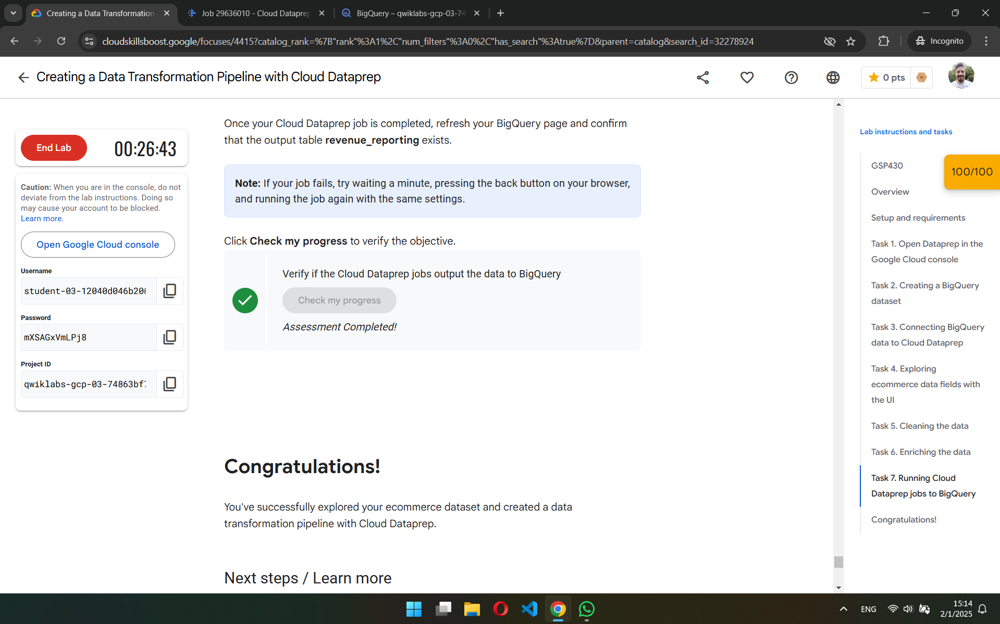

  <h1>Google Skills Boost - Examen Final</h1>
  
  
  <h3>Lab</h3>

Realizar el siguiente LAB, al finalizar pegar un print screen donde se ve su perfil y el progreso final verificado

> Título: Creating a Data Transformation Pipeline with Cloud Dataprep \
> Schedule: 1 hour 15 minutes \
> Cost: 5 Credits \
> [Link](https://www.cloudskillsboost.google/focuses/4415?catalog_rank=%7B%22rank%22%3A1%2C%22num_filters%22%3A0%2C%22has_search%22%3Atrue%7D&parent=catalog&search_id=32278924)

# Contestar las siguientes preguntas:
1. ¿Para que se utiliza data prep?
> Dataprep es un servicio de datos inteligente creado por Alteryx utilizado para visualmente: explorar, limpiar y preparar datos tanto estructurados, como no estructurados.

2. ¿Qué cosas se pueden realizar con DataPrep?
> A traves de una interfaz grafica, se puede realizar:
> - Traer datos de distintas fuentes, incluyendo BigQuery.
> - Trabajar con datos tanto estructurados como no estructurados.
> - Exploracion de datos a traves de una visualizacion simple.
> - Limpieza de datos.
> - Transformaciones de datos.
> - Normalizacion de datos.
> - Generar una receta de transformaciones de datos, guardar la tabla modificada y enviarla a distintos lugares.

3. ¿Por qué otra/s herramientas lo podrías reemplazar? Por qué?
> Herramientas cloud:
> - Dataflow y Dataproc: Para procesamiento de datos.
> - Looker Studio: para análisis y visualización de datos.\
> Herramientas on premise:
> - Apache Spark / PySpark: Para procesamiento de datos.
> - Power BI: Para análisis y visualización de datos.
> - Python (paquetes Pandas y Seaborn): Para procesar y visualizar datos.

4. ¿Cuáles son los casos de uso comunes de Data Prep de GCP?
> Para analizar rapidamente datos, conocerlos rapidamente a traves de su interfaz grafica, limpiar y normalizar datos para mejorar su calidad y por ultimo para crear flujos de trabajo automatizados a traves de sus recipes.

5. ¿Cómo se cargan los datos en Data Prep de GCP?
> Creando un nuevo flujo. Luego de darle un nuevo nombre y una descripcion, pulsamos sobre el signo `+` en donde dice "Connect to your data" y en la ventana emergente pulsamos sobre el texto que dice: "Import datasets" y seleccionamos en el panel de la izquierda que fuente que queremos. Luego elegimos que base de datos utilizar y dentor de ella, que tabla. Pulsamos en el boton "Import & add to flow" para agregarlo al flujo.
> 
> En el ejericio de SkillBoost, seleccionamos BigQuery como nuestra fuente de datos, `ecommerce` como la base de datos y la tabla `all_sessions_raw_dataprep`.

6. ¿Qué tipos de datos se pueden preparar en Data Prep de GCP?
> Se pueden preparar tanto datos estructurados y no estructurados.

7. ¿Qué pasos se pueden seguir para limpiar y transformar datos en Data Prep de GCP?
> Una vez cargados los datos, debe crearse un nuevo `Recipe` (*Receta*). Para esto, hacer click en el icono de archivo que esta debajo del titulo `*Recipe*` y luego en el panel emergente de la derecha clickear en `*Edit Recipe*`. Una vez dentro de la interfaz grafica de los datos.
>
> Luego pueden limpiarse y/o transformarse los datos segun el orden que uno desease, ya sea pulsando sobre los botones de la barra de herramintas o de querer hacer alguna transformacion en una columna especifica, hacer click en los 3 puntos y seleccionar la opcion que uno desee.

8. ¿Cómo se pueden automatizar tareas de preparación de datos en Data Prep de GCP?
> Se puede automatizar a traves de la exportacion de los recipes o work flows.

9. ¿Qué tipos de visualizaciones se pueden crear en Data Prep de GCP?
> - Tablas y gráficos
> - Gráficos de barras y líneas

10.  ¿Cómo se puede garantizar la calidad de los datos en Data Prep de GCP?
> - Validación y verificación de los datos
> - Uso de reglas de calidad de datos
> - Monitoreo y seguimiento de la calidad de los datos
> - Uso de técnicas de limpieza y transformación de datos.

# Arquitectura:
El gerente de Analitica te pide realizar una arquitectura hecha en GCP que contemple el uso de esta herramienta ya que le parece muy fácil de usar y una interfaz visual que ayuda a sus desarrolladores ya que no necesitan conocer ningún lenguaje de desarrollo.

Esta arquitectura debería contemplar las siguiente etapas:

**Ingesta**: Datos parquet almacenados en un bucket de S3 y datos de una aplicación que guarda sus datos en Cloud SQL.

**Procesamiento**: Filtrar, limpiar y procesar datos provenientes de estas fuentes.

**Almacenar**: Almacenar los datos procesados en BigQuery.

**BI**: Herramientas para visualizar la información almacenada en el Data Warehouse.

**ML**: Herramienta para construir un modelo de regresión lineal con la información almacenada en el Data Warehouse.

## Arquitectura propuesta:

